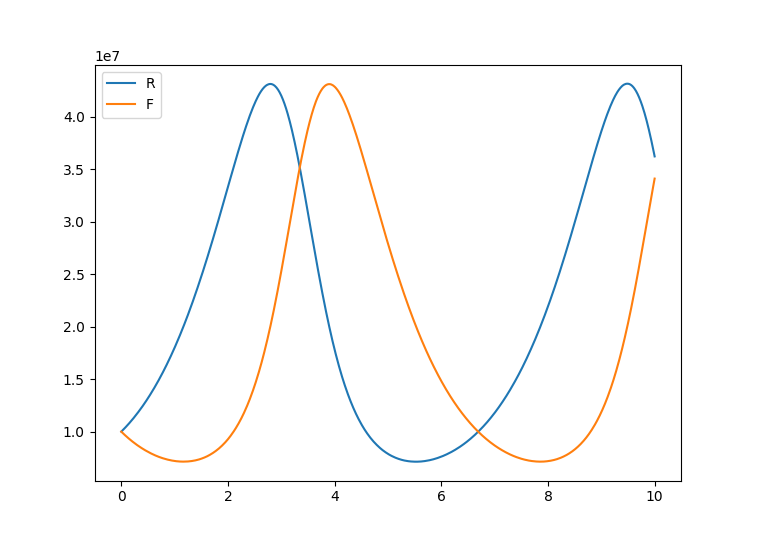

# batss Python package

The `batss` package (batched stochastic simulator) is used for simulating stochastic chemical reaction networks (CRNs). The package and further example notebooks can be found on [Github](https://github.com/UC-Davis-molecular-computing/batss).

If you find batss useful in a scientific project, please cite its associated paper:

> <ins>Exactly simulating stochastic chemical reaction networks in sub-constant time per reaction</ins>.  
  Joshua Petrack and David Doty.
  preprint  
  [ [paper](https://arxiv.org/abs/2508.04079) | [BibTeX](README_files/bibtex.txt) ]

The core of the simulator is inspired by a [batching algorithm](https://arxiv.org/abs/2005.03584) for population protocols (chemical reaction networks with exactly two reactants and two products per reaction) that gives significant asymptotic gains for protocols with relatively small reachable state sets. It adapts this for general CRNs. The package is designed to be run in a Python notebook, to concisely describe complex protocols, efficiently simulate their dynamics, and provide helpful visualization of the simulation.

## Table of contents

* [Installation](#installation)
* [First example CRN](#first-example-crn)
<!-- * [Larger state protocol](#larger-state-protocol)
* [Protocol with Multiple Fields](#protocol-with-multiple-fields)
* [Simulating Chemical Reaction Networks (CRNs)](#simulating-chemical-reaction-networks-crns) -->

## Installation

The package can be installed with `pip` via


```bash
pip install batss
```

## First example CRN

We will show how to simulate the Lotka-Volterra oscillator,

$$\begin{aligned}
R &\to 2R,\\
R + F &\to 2F,\\
F &\to \emptyset,
\end{aligned}$$

with all rate constants 1.

Within python, begin by importing batss. To specify your species, use the `species` function:

```python
import batss
r,f = batss.species('R F')
```

batss overloads operators to allow reactions to be specified in a way visually similar to the way they are typically notated. In this case,

```python
rxns = [
    (r+f >> 2*f),
    (r >> 2*r),
    (f >> None),
]
```

Each line creates a reaction by specifying the reactants and products. Rate constants default to 1; they can be specified inline, e.g. the first reaction's rate constant could be set to 0.5 by replacing the first reaction line with

```python
(r+f >> 2*f).k(0.5),
``` 

Next, specify initial molecular counts and create a `Simulation` object. The `Simulation` class is the most important object in the module, responsible for parsing the reactions, performing the simulation, and giving data about the simulation.

```python
inits = {r: 10 ** 7, f: 10 ** 7}
sim = batss.Simulation(inits, rxns)
```

Now, we can run the simulation.

```python
end_time = 10.0
checkpoint_time = end_time / 1000
sim.run(end_time, checkpoint_time)
```

This will cause the ``Simulation`` to simulate the CRN until continuous time 10.0, recording the state at 1000 uniformly spaced sample times. This shouldn't take more than 10 seconds to execute (at time of writing, it took about 5 seconds on a Macbook Air). We can plot these using matplotlib:

```python
from matplotlib import pyplot as plt
f, ax = plt.subplots()

ax.plot(sim.history['R'], label = 'R')
ax.plot(sim.history['F'], label = 'F')
plt.legend()
plt.show()
```

This produces this graph:



## More examples
See [examples](examples/). [PLACEHOLDER; doesn't exist yet]